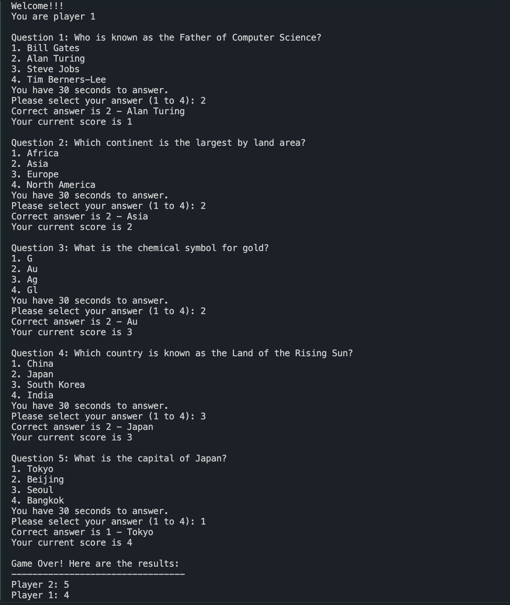
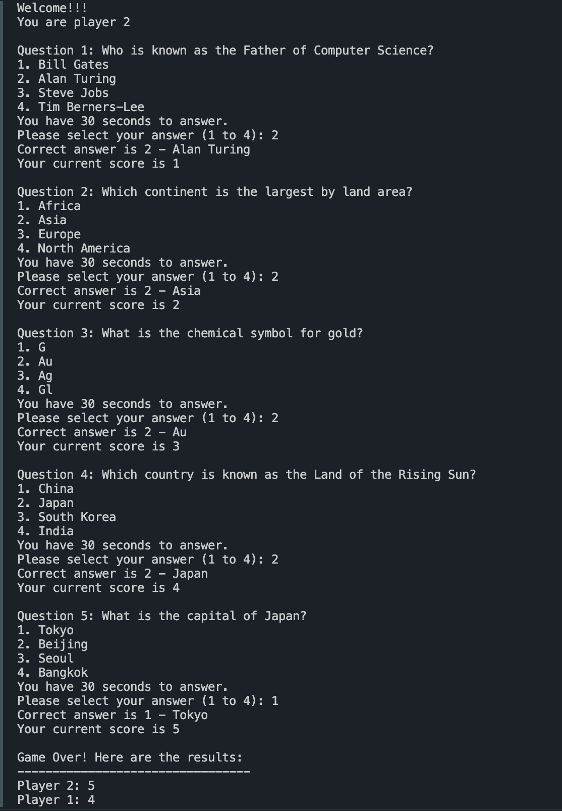

# Quizzy: Real-Time Multiplayer Quiz Game

## Introduction
Welcome to Quizzy, a real-time multiplayer quiz game implemented in Java. Challenge your friends or compete against random opponents in this exciting trivia adventure! Quizzy utilizes Java Datagram and Socket classes to establish a TCP connection between the server and client programs, ensuring smooth communication between players.

## Features
- Real-time multiplayer gameplay.
- Multiple-choice trivia questions.
- Server-client architecture for seamless communication using TCP (implemented using Datagram and Socket classes).
- Multithreading for efficient management of game timelines (using Thread class).
- Timer functionality to keep track of time per question (using sleep method in Thread).
- Synchronized functions to ensure data consistency in a multi-threaded environment (using synchronized function).
- Handle different types of messages in Client program.
- Send different types of messages including welcome message, questions, scores, and result. Perform answer checking, score recording, and create results based on players' scores.

## Installation
To run Quizzy on your local machine, follow these steps:
1. Clone the Quizzy repository.
2. Compile the Java source files using your preferred Java compiler.
3. Run the server program on one machine.
4. Run the client program on multiple machines to join the game.

## How to Play
1. Launch the Server program.
2. Launch the Client program on different machines or on different terminals.
3. Wait for other players to join.
4. Once the game starts, answer the trivia questions within the allotted time.
5. Earn points for each correct answer.
6. The player with the highest score at the end of the game wins.

## Game Example

