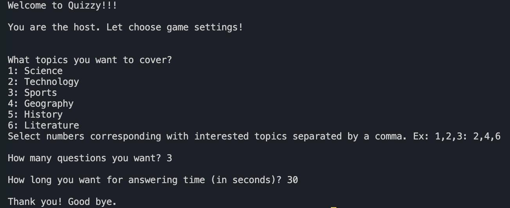
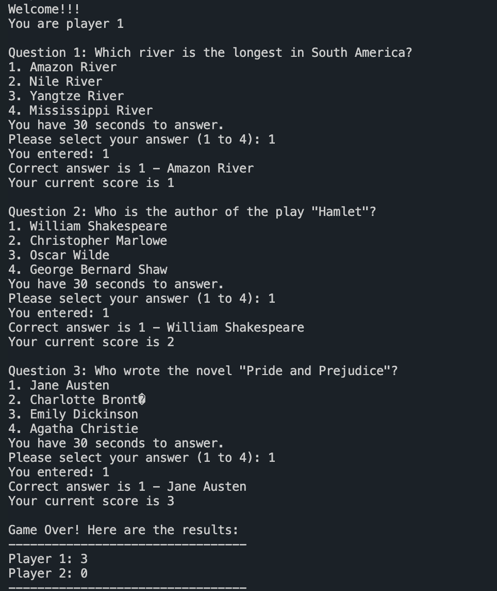
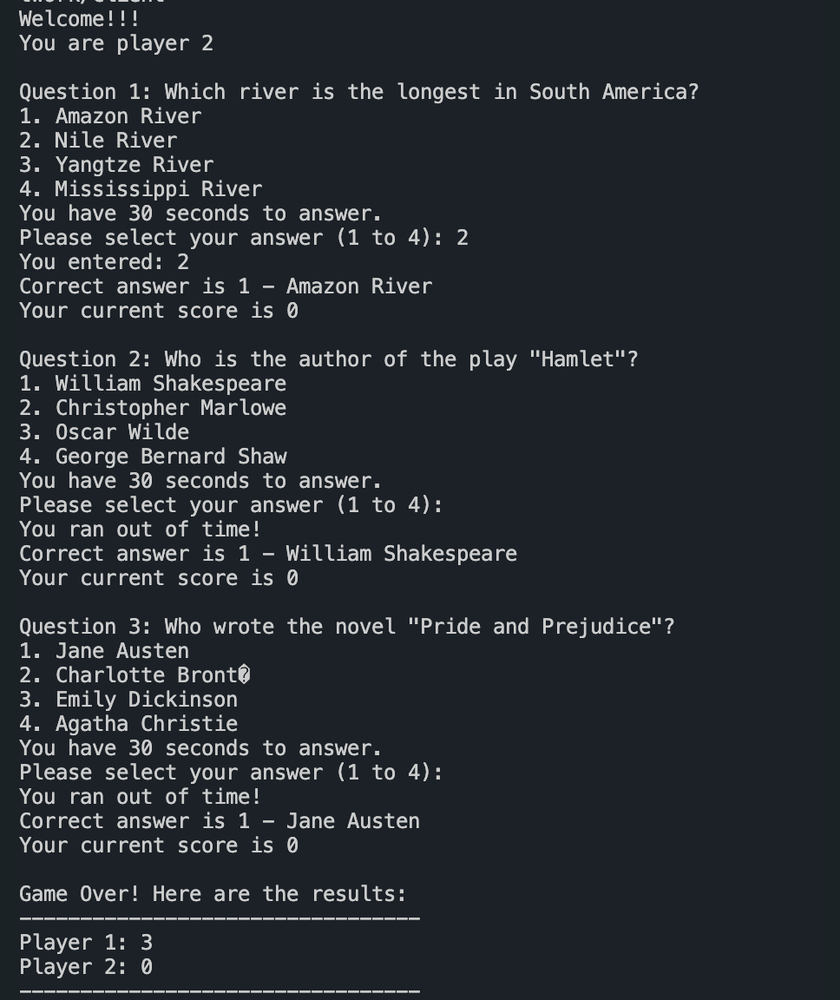

# Quizzy: Real-Time Multiplayer Quiz Game

## Introduction
Welcome to Quizzy, a real-time multiplayer quiz game implemented in Java. Challenge your friends or compete against random opponents in this exciting trivia adventure! Quizzy utilizes Java Datagram and Socket classes to establish a TCP connection between the server and client programs, ensuring smooth communication between players.

## Features
- Server-Client Architecture: We use Transmission Control Protocol (TCP) for Quizzy to ensure that the messages are relayed efficiently and reliably between the players and the server. TCP is a standard that defines how to establish and maintain a network conversation. Some of the key features of TCP are (1) Reliability, (2) Ordered delivery, (3) Flow control, and (4) Connection-oriented. This was implemented using Socket class in Java.
- Real-time multiplayer gameplay.
- Multiple-choice trivia questions.
- Multithreading for efficient management of multi-player function (using Thread class).
- Timer functionality to effectively manage the timeline of the game like waiting for players to answer, waiting for the Server to send score to players, and some other (using sleep method in Thread).
- Synchronized functions to ensure data consistency in a multi-threaded environment (using Java synchronized method).
- Handle different types of messages in Client program, categorized by adding a character before each message like “q” for question message, “s” for score message, “w” for welcome message, and “r” for result message.
- The Server sends different types of messages including welcome message, questions, scores, and result. Perform answer checking, score recording, and create results based on players' scores.
- Handle Timeout when the server doesn’t receive an answer from players (clear buffer reader after each
question).
- The Server will randomly pick questions.
- Add Host role to game. A host can select question topics, number of questions, and time allowed for
each question.
- Quizzes Generation: We use the ChatGPT API (OpenAI, n.d.) to generate quizzes based on a specific
topic, number of questions, and difficulty level. (We created functions for this but haven’t integrated to
the game yet)

## Installation
To run Quizzy on your local machine, follow these steps:
1. Clone the Quizzy repository.
2. Compile the Java source files using your preferred Java compiler.
3. Run the server program on one machine.
4. Run the host program on another machine to set up game.
5. Run the client program on multiple machines to join the game.

## How to Play
1. Launch the Server program (java network/Server).
2. Launch the Host program (java network/Host) to set up game.
3. Launch the Client program on different machines or on different terminals (java network/Client).
4. Wait for other players to join.
5. Once the game starts, answer the trivia questions within the allotted time.
6. Earn points for each correct answer.
7. The player with the highest score at the end of the game wins.

## Game Example

